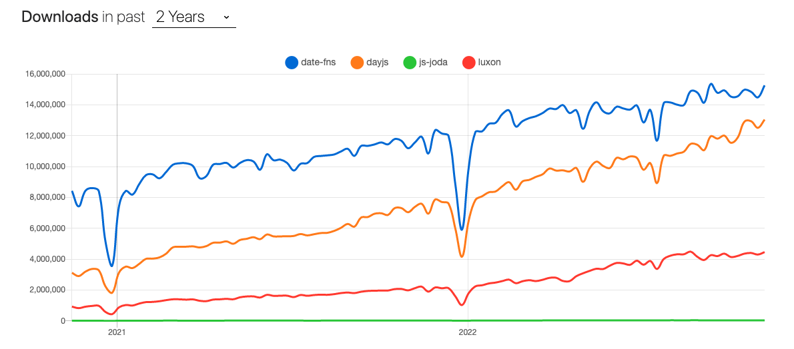
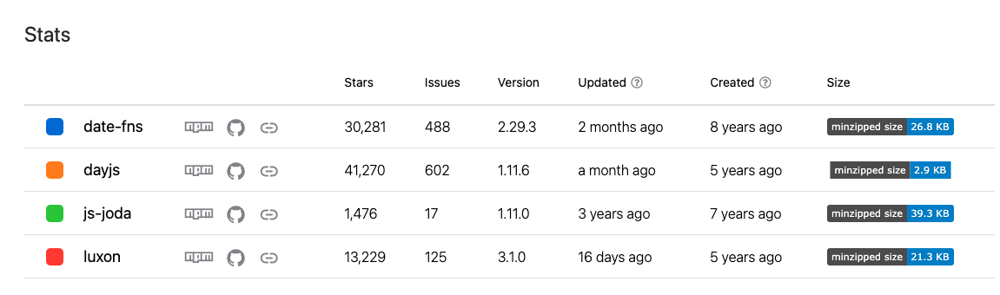

# Date Libraries Compare POC 

## Libraris 
The functionality and other features of 4 Date JS libraries are compared.

*DST Informations*
- [DST Check](https://bobbyhadz.com/blog/javascript-date-check-if-dst)

### Moment JS
### Luxon JS
- [Timezone Info](https://github.com/moment/luxon/blob/master/docs/zones.md)

*DST Issues*
- [link1](https://stackoverflow.com/questions/69907858/luxon-diff-dst-issue)

### Day JS

*Good Links*
- [link1](https://medium.datadriveninvestor.com/https-medium-com-sabesan96-why-you-should-choose-day-js-instead-of-moment-js-9cf7bb274bbd)
- [link2](https://dev.to/javidjms/dayjs-awesome-lightweight-modern-date-api-and-an-alternative-to-momentjs-49lf)
*DST Issues*
- [link1](https://github.com/iamkun/dayjs/issues/586)
- [link2](https://github.com/iamkun/dayjs/issues/1271)
- [link3](https://github.com/iamkun/dayjs/issues/1260)
- [link4](https://github.com/iamkun/dayjs/issues/1437)

### Date-fns
*DST Issues*
- [link1](https://github.com/date-fns/date-fns/issues/1788)
